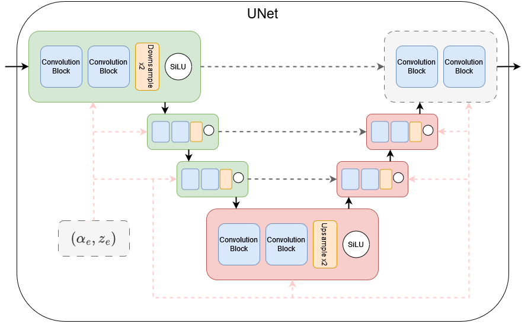

# Latent audio diffusion for music generation with expressive control
    Alfred Pichard, Hugo Audas, Paul Triana, Tom Oviste

[Web Page](https://alfredpichard.github.io/LADMG/)  
[Project on Github](https://github.com/AlfredPichard/LADMG)

## Introduction
Recent advances in generative deep learning models provide exciting new tools for music generation. In particular, the conditioning capabilities of diffusion models offer interesting possibilities to add expressive control to the generation process, which helps make it a more accessible tool. 

In this project, we apply the novel diffusion method Iterative $\alpha$-(de)Blending [HBC23](https://arxiv.org/abs/2305.03486), which simplifies the usual formalism of stochastic diffusion models to a deterministic one, so as to generate audio loops from pure noise. We use the EnCodec [DCSA20](https://arxiv.org/abs/2210.13438) high fidelity neural autoencoder to generate latent codes of a compressed audio representation. Conditioning is applied using either beats-per-minute information or high-level audio concepts, and reinforced using classifier-free guidance [HS22](https://arxiv.org/abs/2207.12598). The latent codes are then inverted back to a waveform with the decoder. 

Finally, we assess the quality of our method on a large dataset of minimal house and techno music.

## Architecture
The project is currently composed of 3 independant branches, which aim to be merged in the future into a single main one. Each branch corresponds to a different approach of conditioning we decided to apply, but share a common base :
  - We rely on EnCodec [DCSA20](https://arxiv.org/abs/2210.13438) Encoder/Decoder, trained on our dataset to train our model with the latent representation of our preferred audio dataset in a lighter format.
  - We use a UNet architecture for our Iterative $\alpha$-(de)Blending process [HBC23](https://arxiv.org/abs/2305.03486).
  

(See code contained in ’/src’ for further details on each module)

## Conditioning
Conditioning is applied separately in the corresponding branches with CLAP [WCZ+23](https://arxiv.org/abs/2211.06687) ([branch link](https://github.com/AlfredPichard/LADMG/tree/clap)) and a beat-per-minute audio descriptor ([branch link](https://github.com/AlfredPichard/LADMG/tree/bpm_conditioning))

## Results
### BPM
To get a learnable representation of rhythm, we use a beat-tracking information extracted from our audio samples metadata during pre-processing. Inference is done using a similar process : to get a more musically coherent output, we condition the input of our model with a constant BPM value that we transform into time signatures then a saw-tooth signal. Results are unequivocal as we can easily hear the influence of our conditioning on our generated audios.

#### Generated loops without bpm conditioning

<audio src="resources/audios/generated_1_no_bpm.m4a" controls title="N0_BPM"></audio>

#### Generated loops with bpm conditioning 

- 122 BPM :
<audio src="resources/audios/generated_audio_1_122bpm.m4a" controls title="122_BPM_1"></audio>
<audio src="resources/audios/generated_audio_9_122bpm.m4a" controls title="122_BPM_2"></audio>

- 125 BPM : 
<audio src="resources/audios/generated_audio_6_125bpm.m4a" controls title="125_BPM_1"></audio>
<audio src="resources/audios/generated_audio_7_125bpm.m4a" controls title="125_BPM_2"></audio>

- 128 BPM :
<audio src="resources/audios/generated_audio_4_128bpm.m4a" controls title="128_BPM_1"></audio>
<audio src="resources/audios/generated_audio_5_128bpm.m4a" controls title="128_BPM_2"></audio>

### CLAP
When training the model on conditioning with CLAP latent codes, the model learns to map the CLAP dual-modal latent space to the EnCodec latent space. Because EnCodec has both an encoder and a decoder, the combined process of deblending and decoding can be viewed as a decoder for the CLAP latent space. This can be used as a text-to-music process or can be very useful for applying transformations directly in the CLAP latent space.

- Original Audio
<audio src="resources/audios/original_audio_clap.m4a" controls title="Original"></audio>

- Generated Audio Conditioned on CLAP
<audio src="resources/audios/generated_audio_clap.m4a" controls title="CLAP"></audio>

## References
 - [HBC23](https://arxiv.org/abs/2305.03486) Eric Heitz, Laurent Belcour, and Thomas Chambon. Iterative alpha-(de)blending: a minimalist deterministic diffusion model. arXiv preprint arXiv:2305.03486, 2023.
 - [DCSA20](https://arxiv.org/abs/2210.13438) Alexandre Défossez, Jade Copet, Gabriel Synnaeve, and Yossi Adi. High fidelity neural audio compression. preprint arXiv:2210.13438, 2020.
 - [HS22](https://arxiv.org/abs/2207.12598) Jonathan Ho and Tim Salimans. Classifier-free diffusion guidance. arXiv preprint arXiv:2207.12598, 2022.
 - [WCZ+23](https://arxiv.org/abs/2211.06687) Yusong Wu, Ke Chen, Tianyu Zhang, Yuchen Hui, Taylor Berg-Kirkpatrick, and Shlomo Dubnov. Large-scale contrastive language-audio pretraining with feature fusion and keyword-to-caption augmentation. ICASSP 2023-2023 IEEE International Conference on Acoustics, Speech and Signal Processing (ICASSP), pages 1–5, 2023.
